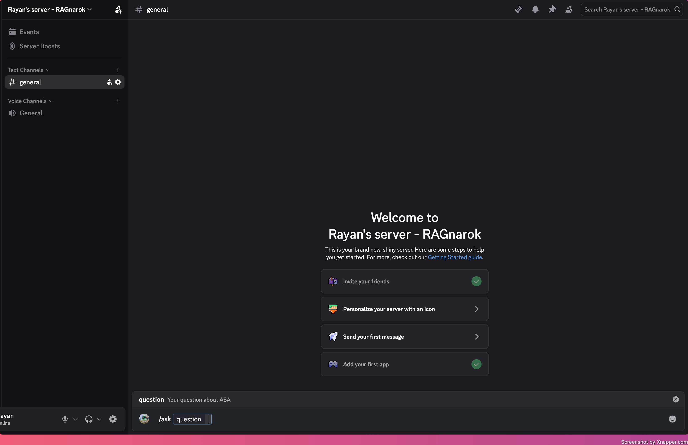
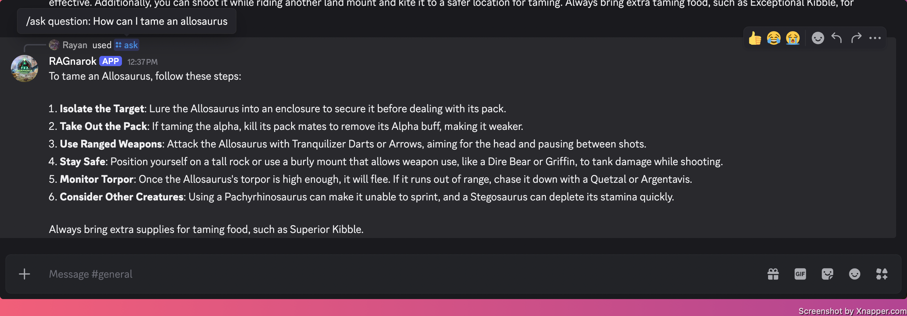
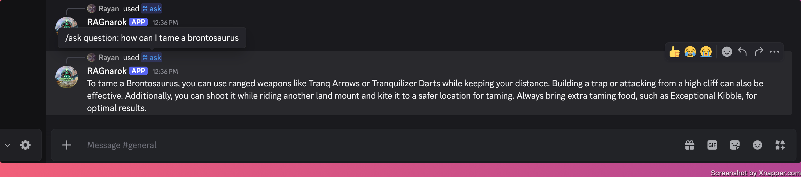

# RAGnarok

A serverless Discord bot that answers questions about Ark: Survival Ascended. You ask it something with the `/ask` command, and it searches a knowledge base built from the ARK wiki, pulls out the most relevant passages, and uses an LLM to write an answer grounded in what it found (so it isn't just making things up).

Under the hood it's a Retrieval-Augmented Generation (RAG) pipeline running entirely on AWS Lambda, using hybrid search: semantic embeddings for meaning plus keyword matching for exact terms.

## Demmo






Example:

```
/ask What saddle do I need to ride a Rex?
→ RAGnarok is thinking...
→ The Rex requires a Rex Saddle to ride, which is unlocked as an engram...
```

## What it deos

This project puts a full RAG system into a real, deployed product:

- builds a knowledge base from the ARK wiki (scrape, clean, chunk, embed)
- hybrid retrieval (semantic + keyword) over a vector database
- grounded answer generation with an LLM
- a real Discord integration with request signature verification
- everything deployed as infrastructure-as-code on AWS

## Tech Stack

- Language: Python 3.13
- Web framework: FastAPI + Mangum (runs FastAPI on Lambda)
- Infrastructure: AWS SAM (Lambda, API Gateway, IAM)
- Embeddings: OpenAI text-embedding-3-small
- Answer generation: OpenAI gpt-4o-mini
- Vector database: Pinecone (hybrid dense + sparse search)
- Keyword search: BM25 (pinecone-text)
- Ingestion: requests + BeautifulSoup + pandas
- Signature verification: PyNaCl (Ed25519)

## Architecture Overview

RAGnarok runs as two Lambda functions. The reason for two is that Discord expects a reply within 3 seconds, but actually generating an answer takes longer than that.

1. User runs `/ask` in Discord.
2. Discord sends a signed request to the handler Lambda.
3. The handler verifies the signature, then replies with a "thinking..." message right away, so Discord is satisfied inside the 3 second window.
4. Just before replying, the handler asynchronously invokes the worker Lambda with the question.
5. The worker embeds the question and runs a hybrid search against Pinecone to get the most relevant chunks.
6. Those chunks are passed to gpt-4o-mini, which writes an answer using only that context.
7. The worker edits the original "thinking..." message with the final answer.

## Data Pipeline

The knowledge base is built ahead of time by `scripts/ingest.py`, which runs locally and never gets deployed. It scrapes ARK wiki pages through the MediaWiki API, cleans the HTML down to plain text, splits each page into roughly 500 token chunks, embeds them, fits a BM25 model, and uploads everything to Pinecone.

## Project Structure

```text
.
├── src/app          handler Lambda (verifies, defers, invokes worker)
├── src/worker       worker Lambda (retrieval + generation + Discord reply)
├── scripts
│   ├── ingest.py             builds the knowledge base
│   └── register_commands.py  registers the /ask command with Discord
├── tests            handler tests (run offline)
└── template.yaml    AWS SAM infrastructure
```

## Local Development Setup

### Prerequisites

- Python 3.13
- AWS SAM CLI and Docker
- Accounts for OpenAI, Pinecone, and a Discord application
- AWS credentials configured in your environment

### 1) Install dependencies

```bash
python -m venv .venv
source .venv/bin/activate
pip install -r requirements-dev.txt
```

Copy `.env.example` to `.env` and fill in your keys.

### 2) Build the knowledge base

```bash
python scripts/ingest.py
```

### 3) Deploy

```bash
sam build --use-container
sam deploy --guided
```

Pass your OpenAI and Pinecone keys as parameters during deploy. Then register the slash command and paste the deploy's endpoint URL into the Discord developer portal:

```bash
python scripts/register_commands.py
```

## Cost

Running this is basically free at personal scale. Each question costs a fraction of a cent, mostly from the gpt-4o-mini call, and both Pinecone and Lambda stay inside their free tiers. Building the knowledge base is a one-time cost of a few cents in embeddings.

## Notes and Limitations

- The knowledge base currently covers a slice of creature pages. `ingest.py` scales to the full wiki by widening its page list.
- Facts stored in wiki infobox tables (like exact saddle unlock levels) don't retrieve as well, since tables get stripped during cleaning. The main article text works well.
- Auth is handled entirely by Discord's request signatures, so the endpoint is intentionally public.

## Roadmap

1. Expand the knowledge base to the full wiki.
2. Extract infobox tables so exact stats are searchable.
3. Add conversation memory so follow-up questions work.

## License

This project is licensed under the terms in [LICENSE](LICENSE).
