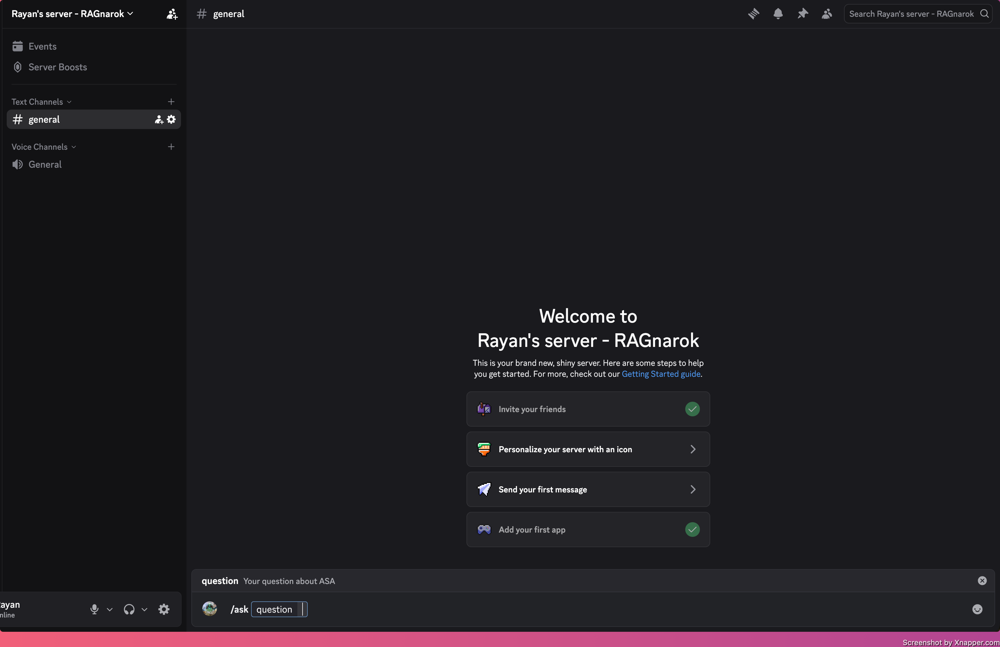
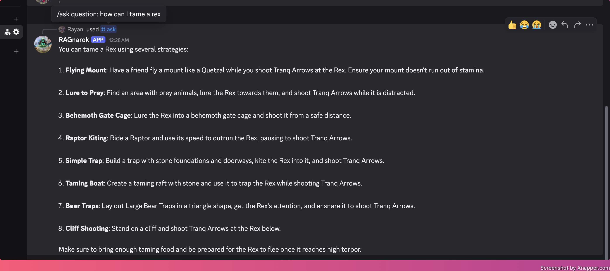
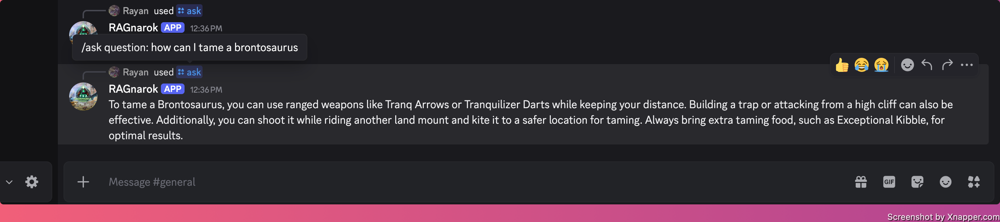
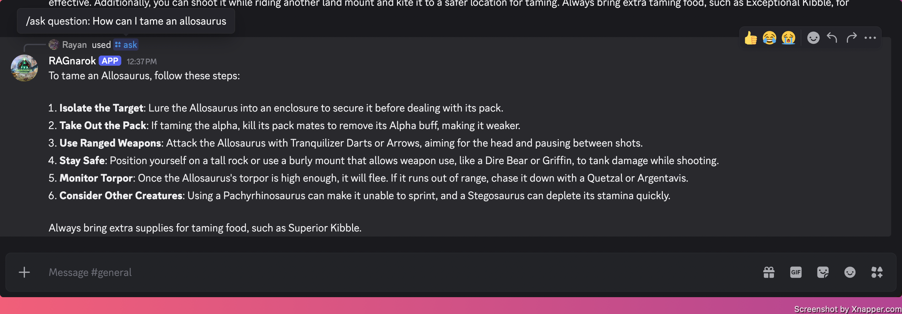

# RAGnarok

A Discord bot that answers Ark: Survival Ascended questions. You type `/ask`, it searches the ARK wiki and writes an answer from what it found.

**[Join the Discord and try it](https://discord.gg/SZ9HXsxMn)**

## Why

I built this for myself. I wanted to know how to tame certain dinos and what to feed them. Asking ChatGPT on the free plan meant hitting the limit and waiting a few hours. Googling meant digging 5 links deep. So I made a bot that only reads the wiki. It costs about a third of a cent per question, which is next to nothing per month.

## Demo






## How it works

It's a RAG pipeline running on two AWS Lambdas.

1. You run `/ask` in Discord.
2. Discord sends a signed request to the handler Lambda. The handler checks the signature, replies "thinking..." right away, and passes the question to the worker Lambda. Discord wants a reply within 3 seconds and a real answer takes about 3, so the slow part has to run somewhere else.
3. The worker embeds the question and runs a hybrid search in Pinecone. Dense vectors match meaning. BM25 matches exact Ark terms like "engram".
4. The top 8 chunks go to gpt-5.4-mini with instructions to answer only from that context.
5. The worker edits the "thinking..." message with the answer.

## Knowledge base

`scripts/ingest.py` runs locally and never gets deployed. It pulls every creature page on the wiki plus 17 mechanics pages like Taming, Breeding and Imprinting. It cleans them to plain text, pulls out the infobox facts like saddle level, kibble and incubation time, then chunks, embeds and uploads everything to Pinecone.

370 pages, 2,371 chunks, about $0.02 per full run.

## Tuning

Hybrid search has a knob that sets how much weight goes to meaning vs keywords. I guessed keyword-heavy would win, since Ark has a lot of weird names. Then I measured it.

`scripts/eval_retrieval.py` runs 20 test questions, 5 with misspelled dino names, and checks if the right page comes back. Pure keyword search got 70%. A 0.7 blend toward meaning got 100%. Keywords lost for two reasons. BM25 can't match "gigantoraptr" at all. And once the corpus grew 7x, words like "egg" showed up in thousands of chunks and stopped meaning anything.

## Cost

Measured over real queries, about $0.0033 per question. OpenAI is 99% of that. Lambda and Pinecone stay inside their free tiers.

## Tech stack

- Python 3.13, FastAPI + Mangum
- AWS SAM: Lambda on arm64, API Gateway, IAM
- OpenAI text-embedding-3-small for embeddings, gpt-5.4-mini for answers
- Pinecone for hybrid dense + sparse search
- BM25 via pinecone-text
- requests, BeautifulSoup and pandas for ingestion
- PyNaCl for Discord's Ed25519 signature check

## Project structure

```text
.
├── src/app          handler Lambda: verifies, defers, invokes worker
├── src/worker       worker Lambda: retrieval, generation, Discord reply
├── scripts
│   ├── ingest.py             builds the knowledge base
│   ├── eval_retrieval.py     scores retrieval across blend values
│   └── register_commands.py  registers /ask with Discord
├── tests            handler tests, run offline
└── template.yaml    AWS SAM infrastructure
```

## Run it yourself

You need Python 3.13, the AWS SAM CLI, Docker, AWS credentials, and accounts for OpenAI, Pinecone and a Discord application.

```bash
python -m venv .venv
source .venv/bin/activate
pip install -r requirements-dev.txt
cp .env.example .env   # fill in your keys
```

Build the knowledge base, then copy the fitted BM25 encoder into the worker. The worker loads its own copy, and a stale one silently breaks keyword search.

```bash
python scripts/ingest.py
cp data/bm25_encoder.json src/worker/
```

Deploy, register the command, then paste the endpoint URL into the Discord developer portal.

```bash
sam build --use-container
sam deploy --guided
python scripts/register_commands.py
```

If your OpenAI project limits which models it can use, allow both text-embedding-3-small and gpt-5.4-mini. I only allowed the chat model once and every question failed with a 403.

## Limitations

- No memory. Every `/ask` is standalone, so follow-up questions don't work yet.
- Answers are only as fresh as the last ingest. After a game patch, re-run it.
- No rate limiting yet, so one person could spam it.

## Roadmap

- Wiki source links in every answer
- Per-user rate limits
- Follow-up questions

## License

See [LICENSE](LICENSE).
