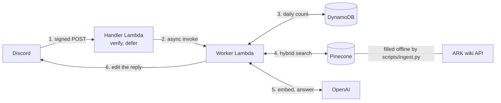
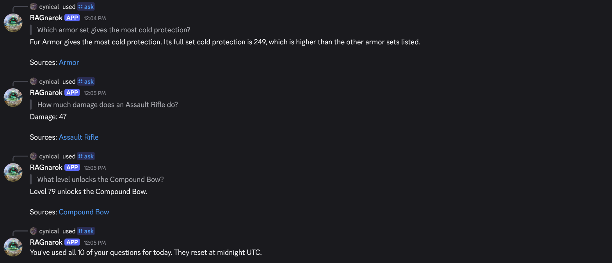

# RAGnarok

A Discord bot that answers Ark: Survival Ascended questions. You type `/ask`, it searches the ARK wiki and writes an answer from what it found, with links to the pages it used. A server can also load its own rules and rates, and the bot uses those where the wiki would be wrong for that server.

**[Join the Discord and try it](https://discord.gg/SZ9HXsxMn)**


| At a glance | |
|---|---|
| Knowledge base | 791 wiki pages: every creature, weapon, armor piece and saddle, plus core mechanics |
| Answer time | 1 to 2 seconds once warm |
| Retrieval accuracy | 38 of 38 test questions, 9 of them deliberately misspelled |
| Server notes | each Discord server can add its own rules, rates and perks, kept in a private namespace |
| Cost | about $0.0027 per question |
| Running cost when idle | $0 |

## Why

I built this for myself. I wanted to know how to tame certain dinos and what to feed them. ChatGPT on the free plan kept hitting the limit, and when it did answer I had no way to tell which numbers to trust. Googling meant digging through links, half of them written for the older game. So I made a bot that only reads the wiki, shows where each answer came from, and says so when the wiki doesn't have it.

## How it works

It's a RAG pipeline on two AWS Lambdas.


```mermaid
flowchart LR
    D[Discord] -->|1. signed POST| H[Handler Lambda<br/>verify, defer]
    H -->|2. async invoke| K[Worker Lambda]
    K -->|6. edit the reply| D
    K <-->|3. daily count| Q[(DynamoDB)]
    K <-->|4. hybrid search| P[(Pinecone)]
    K <-->|5. embed, answer| O[OpenAI]
    P ---|filled offline by scripts/ingest.py| W[ARK wiki API]
```

1. Discord sends a signed request to the handler Lambda. The handler checks the Ed25519 signature and replies "thinking..." right away. Discord wants a reply within 3 seconds and a cold worker takes about 7, so the slow part has to run somewhere else.
2. Before replying, the handler starts the worker Lambda with an async invoke.
3. The worker checks your daily limit in DynamoDB.
4. It embeds the question and runs a hybrid search in Pinecone. Dense vectors match meaning. BM25 matches exact Ark terms like "engram". If the server has loaded its own notes, a second query pulls three of them from that server's private namespace.
5. The top 8 wiki chunks, plus any server notes, go to gpt-5.4-mini as numbered passages. It has to answer from those passages only, name the ones it used, and return a fixed marker when none of them answer the question.
6. The worker edits the "thinking..." message into the answer and adds links to the source pages.

The knowledge base is built separately. `scripts/ingest.py` runs on my laptop, never on Lambda, and fills Pinecone from the wiki's API.

## Things I measured instead of guessing

### How much to trust keywords

Hybrid search has a knob, alpha, that sets how much weight goes to meaning versus exact keywords. I guessed keyword-heavy would win, since Ark is full of strange names. Then I measured it.

`scripts/eval_retrieval.py` runs 38 questions and checks two things for each: did the right page come back, and is the answer itself in the retrieved text.

| alpha | Right page | Misspelled questions | Answer in text |
|---|---|---|---|
| 0.0, keywords only | 84% | 56% | 79% |
| 0.4 | 95% | 89% | 97% |
| 0.6 to 0.75 | 97% | 100% | 100% |
| **0.8 to 0.9** | **100%** | **100%** | **100%** |
| 1.0, meaning only | 97% | 100% | 100% |

My guess was wrong, for two reasons. BM25 can't match "gigantoraptr" at all, so typos need the dense vector. And keywords lose value as the corpus grows: once "saddle" appears in hundreds of chunks it stops narrowing anything down. The best range was 0.6 to 0.95 at 2,371 chunks and shrank to 0.8 to 0.9 at 3,876. The bot uses 0.85.

### Which model

gpt-5-mini costs a third as much per token as gpt-5.4-mini. `scripts/eval_answers.py` runs questions through the full pipeline and checks each answer for the right fact. It had 19 questions when I compared models.

| Model | Correct | Cost per question | Average wait |
|---|---|---|---|
| **gpt-5.4-mini, no reasoning** | **19/19** | **$0.0027** | **1.0 s** |
| gpt-5-mini, minimal reasoning | 17/19 | $0.0010 | 1.5 s |
| gpt-5-mini, low reasoning | 19/19 | $0.0013 | 3.3 s |

The cheaper model only matches the accuracy with reasoning turned on, and then it bills reasoning tokens and takes three times as long. I kept gpt-5.4-mini.

### What the scraper was throwing away

A retrieval score can be perfect while the bot still can't answer, if the fact never made it into the database. That happened twice.

The first version only kept prose. The wiki keeps its numbers in infoboxes and tables, so the right page came back every time and the answer wasn't on it. Previewing one page's extracted text showed the gap. The ingest now turns the infobox into a "key facts" line and rewrites each data table as text rows.

| Question | Before | After |
|---|---|---|
| What saddle does an Ankylosaurus need? | I don't know | Ankylo Saddle, level 36 |
| What does a Rex Saddle cost to craft? | I don't know | 380 Hide, 200 Fiber, 50 Metal Ingot |
| Which armor gives the most cold protection? | I don't know | Fur Armor, 249 |
| How much damage does an Assault Rifle do? | I don't know | 47 |

That's why the eval checks for the fact now, and not only the page.

### How to mix a server's notes with the wiki

A server can load its own rules and rates, described under [Server notes](#server-notes). My first plan was to search the notes and the wiki together and keep the eight best scores. I checked it on 8 questions that only the notes could answer. In 3 of them the right note scored below the 8th wiki chunk and would have been dropped. One was "What level do wild dinos go up to?", where the server says 180 and the wiki says 150, so the bot would have given the wrong number.

The two sets of scores can't be compared. The wiki has 3,876 focused chunks and a keyword bonus. A server has a few broad notes scored on meaning alone. So notes don't compete with the wiki. The best three always go in, next to the wiki's eight.

| Notes kept | Right note among them, out of 24 questions |
|---|---|
| 1 | 16 |
| 2 | 22 |
| 3 | 24 |

The prompt needed counting too. When the model applied a server's 5x taming rate itself, it once turned 1h 28m into 4h 20m. It now gives the wiki number and the server's rate and leaves the division to the player. Rule questions turned up a bigger problem, which gets its own section.

### The bot couldn't say no

Server rules are mostly yes/no questions, and testing them is how I found this. The bot refused every question whose true answer was no. "Can you cryopod a Titanosaur?" got "I couldn't find that in the ARK wiki", with "unable to be Cryopoded" sitting in the retrieved text. I tried seven questions like that, five times each, and it answered 0 of 35.

The cause was the last sentence of the prompt, which told the model to reply with the no-answer marker "only if the passages hold nothing that answers the question". The model read a "no" as nothing. Both evals passed the whole time, because none of their questions had "no" as the right answer.

| Prompt ending | "No" questions answered | Questions it should refuse, refused |
|---|---|---|
| Old | 0 of 35 | 40 of 40 |
| Old, with "when the answer is no, say no" added in front | 35 of 35 | 37 of 40 |
| **New: something not being possible is an answer, and the marker is only for when the passages don't cover the question** | **35 of 35** | **40 of 40** |

Adding a sentence fixed the refusals and broke something else. Replacing the sentence fixed both. At 10 tries per question the new ending scored 210 of 210, and the eval now has questions whose answer is no.

It also taught me how many tries a count needs. Six tries per question gave one prompt 119 of 120. The next day the same prompt scored 20 of 30 on its rule questions.

## Knowledge base

`scripts/ingest.py` runs locally and never gets deployed. It lists every page in the wiki's Creatures, Weapons and Armor categories through the MediaWiki API, plus 17 mechanics pages like Taming, Breeding and Imprinting. Over half the Creatures category is redirects, such as "Aberrant Rex" pointing at "Rex", so dropping redirects removes the variant duplicates without a hand-written list.

Each page is cleaned to plain text, cut into 500-token chunks with 50 tokens of overlap, embedded, and uploaded to Pinecone with both vector types.

791 pages, 3,876 chunks, about $0.035 and 35 minutes per full run. The run stops before touching the live index if more than 2% of pages fail to scrape.

## Server notes

A cluster changes the game. Rates are boosted, tribes are capped, ranks come with perks, and none of that is on the wiki. An admin writes those things down as plain `.md` or `.txt` files, and I load them with one command:

```bash
python scripts/ingest_server.py <guild_id> servers/<guild_id>
```

Each server's notes go into their own Pinecone namespace, `guild-<guild_id>`, in the same index as the wiki. The worker builds that name from the guild ID in Discord's signed request, so a question asked in one server can't reach another server's notes. Notes get dense vectors only, because the BM25 encoder is fitted on wiki text. Nothing ships with the Lambda, so new notes are live without a deploy.

When a note and the wiki disagree, the note wins, and the answer says where each part came from:

```text
> How long does a Rex egg take to hatch?
4h 59m 58.561s on the wiki, with egg hatch speed at 10x on this server.

Sources: Rex · Server notes (Rates)
```

`scripts/eval_server.py` checks a server's own questions, then re-runs the wiki questions with the notes in the context. On my test server's made-up notes it scores 14 of 14 and 23 of 23. Real notes stay out of this repo, in a gitignored `servers/` folder.

## Daily limits by Discord role

Each user gets a number of questions per day, counted in DynamoDB with an atomic `ADD`. Discord includes a member's role IDs in every slash-command request, so a server can give its ranks different limits without any accounts or logins. The table that maps roles to limits is in `src/worker/quota.py`.



## Cost

About $0.0027 per question, measured. OpenAI is 99% of that, and the input context is 94%. Lambda, API Gateway, DynamoDB and Pinecone stay inside their free tiers at this volume, and nothing is billed while nobody is asking. A server with its own notes sends three of them along with every question, which brings its cost to about $0.0035.

## Tech stack

- Python 3.13, FastAPI + Mangum
- AWS SAM: two Lambdas on arm64, API Gateway, DynamoDB, IAM
- OpenAI text-embedding-3-small for embeddings, gpt-5.4-mini for answers
- Pinecone for hybrid dense + sparse search
- BM25 via pinecone-text
- requests, BeautifulSoup and pandas for ingestion
- PyNaCl for Discord's Ed25519 signature check
- pytest for the handler, quota and prompt logic

## Project structure

```text
.
├── src/app          handler Lambda: verifies, defers, invokes worker
├── src/worker       worker Lambda
│   ├── worker.py        quota check, reply, usage log
│   ├── retriever.py     hybrid search, plus the server's own notes
│   ├── generator.py     prompt, answer, source links
│   └── quota.py         daily limits by Discord role
├── scripts
│   ├── ingest.py             builds the knowledge base
│   ├── ingest_server.py      loads one server's notes into its namespace
│   ├── eval_retrieval.py     scores retrieval across blend values
│   ├── eval_answers.py       scores final answers, cost and speed per model
│   ├── eval_server.py        scores answers for a server with its own notes
│   ├── register_commands.py  registers /ask with Discord
│   └── deploy.sh             build and deploy
├── tests            handler, quota and prompt tests, run offline
└── template.yaml    AWS SAM infrastructure
```

## Run it yourself

You need Python 3.13, the AWS SAM CLI, Docker, AWS credentials, and accounts for OpenAI, Pinecone and a Discord application.

```bash
python -m venv .venv
source .venv/bin/activate
pip install -r requirements-dev.txt
cp .env.example .env   # fill in your keys
```

Build the knowledge base. This also writes the fitted BM25 encoder into `src/worker/`, where the worker loads it.

```bash
python scripts/ingest.py
```

Deploy, register the command, then paste the endpoint URL from the deploy output into the Discord developer portal as the Interactions Endpoint URL.

```bash
scripts/deploy.sh
python scripts/register_commands.py
```

Check your work:

```bash
pytest                              # handler, quota and prompt tests, no network
python scripts/eval_retrieval.py    # retrieval accuracy at each alpha
python scripts/eval_answers.py      # answer accuracy, cost and speed
```

If your OpenAI project limits which models it can use, allow both text-embedding-3-small and gpt-5.4-mini. I only allowed the chat model once and every question failed with a 403.

## Limitations

- No memory. Every `/ask` is standalone, so follow-up questions don't work yet.
- Answers are only as fresh as the last ingest. After a game patch, re-run it.
- It covers creatures, weapons, armor and core mechanics. Structures, resources, consumables and maps aren't in yet.
- Out of the box it only knows the vanilla game. A server's rates and rules come from its notes. Mod content isn't covered yet.
- Yes/no facts that the wiki's infobox shows as icons, like whether a creature can be ridden, aren't in the knowledge base yet.
- Server notes are a first version. Each note file is cut into the same 500-token chunks as a wiki page, which is coarse for a long rules document.

## Roadmap

- Structures, resources, consumables and tools
- Maps, caves and boss requirements
- Mod knowledge for modded servers, on top of the server notes
- A queue between the two Lambdas to smooth out bursts

## Credits and license

Game data comes from the [ARK Official Community Wiki](https://ark.wiki.gg), whose content is licensed [CC BY-NC-SA 4.0](https://creativecommons.org/licenses/by-nc-sa/4.0). Every answer links back to the pages it used. This project isn't affiliated with Studio Wildcard.

The code is MIT licensed. See [LICENSE](LICENSE).
